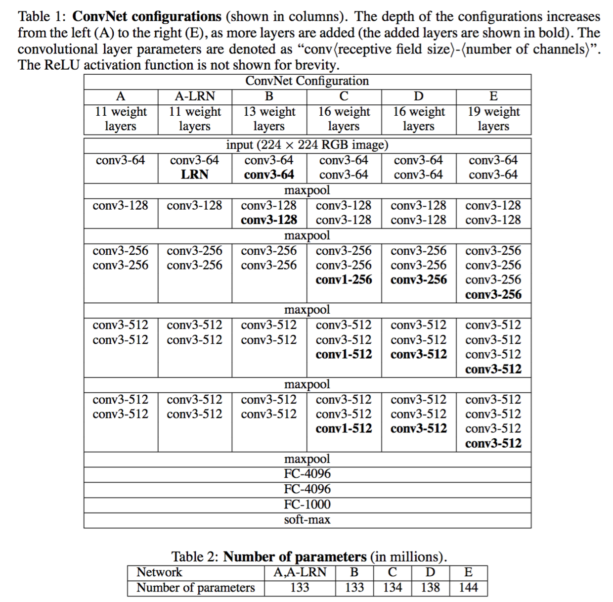
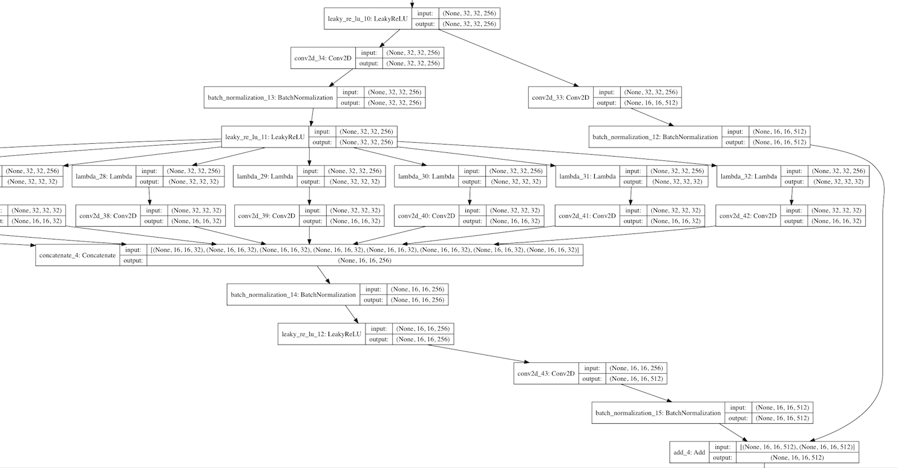
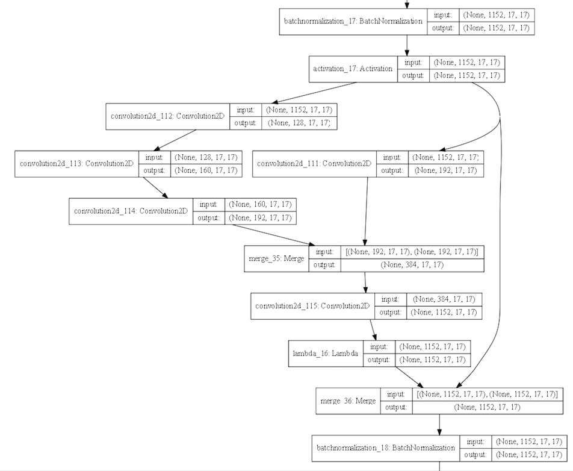
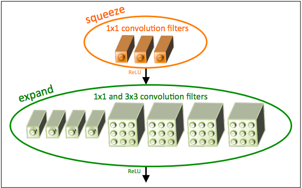
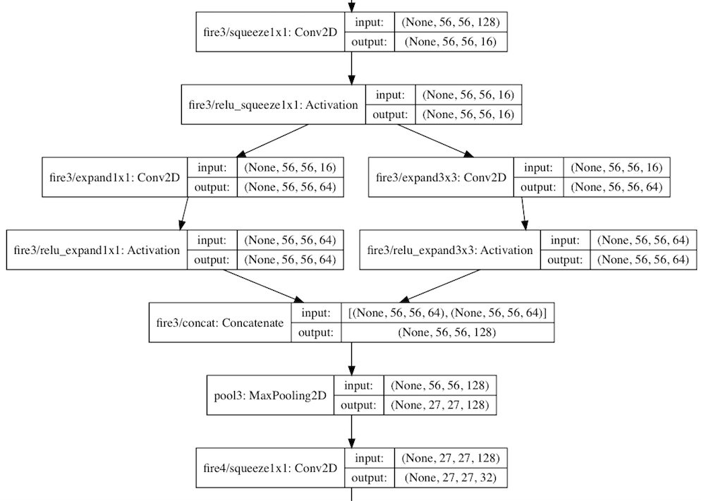

# 神经网络架构

> One image is more than thousands of words.

## VGG

## Inception

不同卷积核并行抽取feature，然后合并。

## ResNet

残差连接，Conv-BN-Conv-BN-Conv-BN

## ResNeXt

基于ResNet残差连接的思想，但是是**相同的多路**。

## Inception-ResNet

ResNet + Inception

## DenseNet

每一层都连接之前所有层，实现的方式很优化，就是把之前的所有层累计concat

## SqueezeNet

通过1\*1把feature变小，然后2路，1\*1和3\*3把channel又扩大后concat，循环往复变深。

同等Accuracy下，模型尽可能小。分布式训练的网络压力小，模型方便网络传输加载，FPGA训练方便。模型中没有全连接层，全连接层参数最多了。

## MobileNet

和Xception一样，使用**depthwise separable convolutions**，即1\*1的卷积

